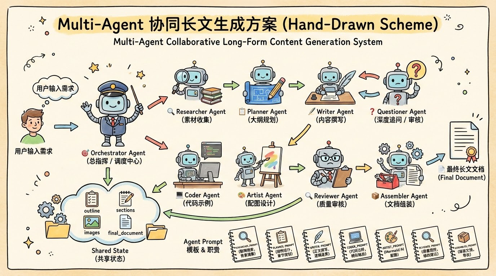

<div align="center">


*Turn complex tech into stories everyone can understand.*

**[中文](README.md) | English**

<p>

[](https://github.com/Anionex/banana-vibe-blog)


</p>

<b>A multi-Agent AI-powered long-form blog generator with deep research, smart illustrations, and Mermaid diagrams,<br></b>
<b>transforming technical knowledge into easy-to-understand articles for everyone</b>

<b>🎯 Lower the barrier to technical writing, making knowledge sharing simpler</b>

<br>

*If this project is useful to you, please star🌟 & fork🍴*

<br>

</div>


## ✨ Project Origin

Have you ever been stuck in this situation: you want to write a technical blog, but don't know how to make it understandable for non-technical readers; you have lots of technical knowledge in mind, but struggle to explain it with vivid metaphors?

Traditional technical blog writing has the following pain points:

- 1️⃣ **Time-consuming**: A high-quality technical article takes hours or even days
- 2️⃣ **Illustration difficulties**: Hard to find suitable images, Mermaid syntax is complex
- 3️⃣ **Lack of depth**: No time for deep research, content tends to be superficial
- 4️⃣ **Single audience**: Difficult to adjust content depth for readers of different technical levels
- 5️⃣ **Tedious distribution**: Need to manually adapt to different platform format requirements

Banana Vibe Blog was born to solve these problems. Based on multi-Agent collaborative architecture, it automatically completes the entire process of research, planning, writing, and illustration, letting you focus on the knowledge itself.

## 👨‍💻 Use Cases

1. **Tech Bloggers**: Quickly generate high-quality technical articles, saving writing time
2. **Developer Advocates**: Transform complex technology into easy-to-understand content, expanding influence
3. **Educators**: Generate teaching materials, using life-like metaphors to help students understand
4. **Product Managers**: Quickly understand technical concepts, better communicate with development teams
5. **Tech Beginners**: Easily get started with new technologies through AI-generated articles


## 🎨 Result Examples

<div align="center">

| | |
|:---:|:---:|
| **Redis Quick Start Tutorial** | **Message Queue Introduction** |
| Build a high-performance cache system from scratch | Build an async communication system from scratch |
| **Distributed Lock Guide** | **Microservices Architecture Intro** |
| Master resource synchronization in 30 minutes | Evolution from monolith to distributed |

</div>


## 🎯 Feature Introduction

### 1. Multi-Agent Collaborative Architecture
Multi-Agent workflow built on LangGraph, each agent with specific responsibilities, collaborating efficiently.
- **Researcher Agent**: Deep research, searching the web for latest materials
- **Planner Agent**: Smart planning, generating well-structured article outlines
- **Writer Agent**: Content creation, writing easy-to-understand section content
- **Coder Agent**: Code generation, providing runnable example code
- **Artist Agent**: Smart illustration, generating Mermaid diagrams and AI images

### 2. Deep Research Capability
- **Zhipu Search Integration**: Automatically search the web for latest technical materials
- **Knowledge Extraction**: Extract key information from search results
- **Citation Annotation**: Automatically annotate information sources, ensuring credibility

### 3. Smart Illustration System
- **Mermaid Diagrams**: Automatically generate flowcharts, architecture diagrams, sequence diagrams
- **AI Cover Images**: Generate cartoon-style covers based on nano-banana-pro
- **Context-Aware**: Generate unique illustrations based on section content

### 4. Multi-Format Export
- **Markdown**: Standard Markdown format, ready for direct publishing
- **Image Export**: One-click export article as long image
- **Live Preview**: Real-time Markdown and Mermaid rendering in frontend


## 🤖 Multi-Agent Collaborative Architecture

<div align="center">



</div>

Banana Vibe Blog adopts a multi-Agent collaborative architecture where each Agent has clear responsibilities and works efficiently together:

- **Orchestrator Agent** (Director): Coordinates the entire workflow
- **Researcher Agent** (Researcher): Deep search and knowledge extraction
- **Planner Agent** (Planner): Generate structured outlines
- **Writer Agent** (Writer): Write section content
- **Coder Agent** (Coder): Generate example code
- **Artist Agent** (Illustrator): Generate Mermaid diagrams and AI images
- **Reviewer Agent** (Reviewer): Quality check and optimization
- **Assembler Agent** (Assembler): Final document assembly

All Agents share unified state management and Prompt template library, ensuring efficient collaboration and consistent output quality.


## 🗺️ Development Roadmap

| Status | Milestone |
| --- | --- |
| ✅ Completed | Multi-Agent architecture (Researcher/Planner/Writer/Coder/Artist) |
| ✅ Completed | Zhipu search service integration |
| ✅ Completed | Mermaid diagram auto-generation |
| ✅ Completed | AI cover image generation (nano-banana-pro) |
| ✅ Completed | SSE real-time progress push |
| ✅ Completed | Markdown live preview rendering |
| ✅ Completed | Export article as image |
| 🧭 Planned | AI Smart Reading Guide (Mind Map + Interactive Reading) |
| 🧭 Planned | PDF knowledge parsing and deep research |
| 🧭 Planned | Podcast format output (TTS synthesis) |
| 🧭 Planned | Tutorial video generation |
| 🧭 Planned | Multi-audience adaptation (students/children/professionals) |
| 🧭 Planned | Comic format output |
| 🧭 Planned | One-click publish to social media platforms |


## 📦 Usage

### Quick Start

1. **Clone the repository**
```bash
git clone https://github.com/Anionex/banana-blog
cd banana-blog
```

2. **Install dependencies**
```bash
cd backend
pip install -r requirements.txt
```

3. **Configure environment variables**
```bash
cp .env.example .env
```

Edit the `.env` file to configure necessary environment variables:
```env
# AI Provider format configuration (openai)
AI_PROVIDER_FORMAT=openai

# OpenAI format configuration
OPENAI_API_KEY=your-api-key-here
OPENAI_API_BASE=https://api.openai.com/v1
TEXT_MODEL=gpt-4o

# Zhipu Search API (optional, for deep research)
ZHIPU_API_KEY=your-zhipu-api-key

# Nano Banana Pro API (optional, for AI cover images)
NANO_BANANA_API_KEY=your-nano-banana-api-key
```

4. **Start the service**
```bash
python app.py
```

5. **Access the application**
- Frontend: http://localhost:5001
- API: http://localhost:5001/api


## 🛠️ Technical Architecture

### Backend Tech Stack
- **Language**: Python 3.10+
- **Framework**: Flask 3.0
- **AI Framework**: LangGraph (Multi-Agent orchestration)
- **Template Engine**: Jinja2 (Prompt management)
- **Real-time Communication**: Server-Sent Events (SSE)

### AI Models & Services
| Function | Provider | Model/API | Description |
|----------|----------|-----------|-------------|
| **Text Generation** | Alibaba Bailian | Qwen (Qianwen) | Used for Agent text generation and reasoning |
| **Web Search** | Zhipu | Web Search API | Used for Researcher Agent's deep research |
| **AI Image Generation** | Nano Banana | nano-banana-pro | Used for AI cover images and illustrations |

### API Endpoints
- **Text Model**: OpenAI-compatible API format
- **Search Service**: `https://open.bigmodel.cn/api/paas/v4/web_search`
- **Image Generation**: `https://api.grsai.com`

### Frontend Tech Stack
- **Rendering**: Native HTML + JavaScript
- **Markdown**: marked.js
- **Code Highlighting**: highlight.js
- **Diagram Rendering**: Mermaid.js
- **Image Export**: html2canvas


## 📁 Project Structure

```
banana-blog/
├── backend/                          # Flask backend application
│   ├── app.py                        # Flask application entry
│   ├── config.py                     # Configuration file
│   ├── requirements.txt              # Python dependencies
│   ├── .env.example                  # Environment variable example
│   ├── static/                       # Static files
│   │   └── index.html                # Frontend page
│   ├── outputs/                      # Generated article output directory
│   │   └── images/                   # Generated images directory
│   └── services/
│       ├── llm_service.py            # LLM service
│       ├── image_service.py          # Image generation service
│       ├── task_service.py           # Task management service
│       └── blog_generator/           # Blog generator core
│           ├── blog_service.py       # Blog generation service
│           ├── graph.py              # LangGraph workflow definition
│           ├── agents/               # Agent implementations
│           │   ├── researcher.py     # Research Agent
│           │   ├── planner.py        # Planning Agent
│           │   ├── writer.py         # Writing Agent
│           │   ├── coder.py          # Code Agent
│           │   ├── artist.py         # Illustration Agent
│           │   └── assembler.py      # Assembly Agent
│           ├── templates/            # Jinja2 Prompt templates
│           │   ├── researcher.j2
│           │   ├── planner.j2
│           │   ├── writer.j2
│           │   ├── coder.j2
│           │   └── artist.j2
│           └── services/
│               └── search_service.py # Search service
├── docs/                             # Documentation directory
└── README.md                         # This file
```


## 🔧 Environment Variables

| Variable | Description | Default |
|----------|-------------|---------|
| `AI_PROVIDER_FORMAT` | AI Provider format | openai |
| `OPENAI_API_KEY` | OpenAI API Key | - |
| `OPENAI_API_BASE` | OpenAI API Base URL | https://api.openai.com/v1 |
| `TEXT_MODEL` | Text generation model | gpt-4o |
| `ZHIPU_API_KEY` | Zhipu Search API Key (optional) | - |
| `NANO_BANANA_API_KEY` | Nano Banana Pro API Key (optional) | - |


## 🤝 Contributing

Welcome to contribute to this project through
[Issue](https://github.com/Anionex/banana-blog/issues)
and
[Pull Request](https://github.com/Anionex/banana-blog/pulls)!


## 📄 License

MIT License
